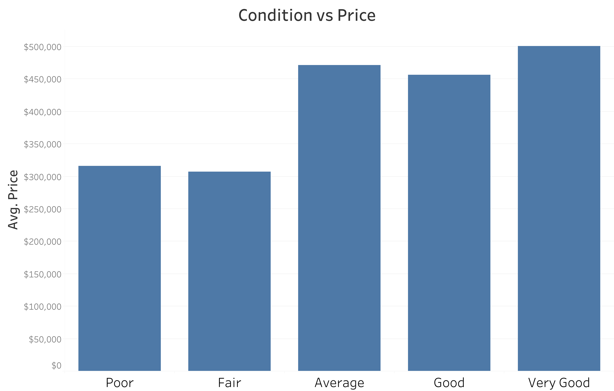
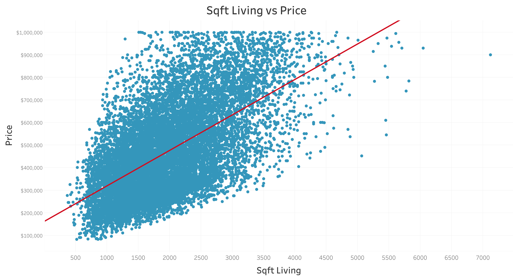

# Analyzing House Sales in King County Washington

# Overview

Data was gathered about house sales in King County, Washington to find a model to predict if a house is worth buying at its listed price and to find what are the best things to increase the value of the house after buying it. The House price predictor was made through making a linear regression model. The two main factors we found that could actually be changed to raise the price of a house were the Sqft Living, and the condition of the house.

# Buisness Problem
Vladamir Geonoffe Housing Co. has approached us with the task to give him a house price predictor and two factors to focus on improving about the house after buying to increase the price. He also made it clear that he didn't want to buy any house over \$1,000,000 or more than 6 bedrooms. With that said we do understand from a business side that nothing we say is a gaurentee that profit will be made. There is always inherent risk in the house market, but we definitely have found trends that give higher chance to be successful.

# Data Understanding
As mentioned above in overview we gathered data from King County, Washinton's website. The data is not as complete as it could be since it data from 2014 and 2015. With more time, we would like to build a newer model from more modern data.

[Source](https://info.kingcounty.gov/assessor/esales/Glossary.aspx?type=r)

# Methods

## Data Preparation

We then cleaned the data. We started by exploring the nulls. We looked into the nulls to see if they were repersenting any value, or if they were miss entered information. We also checked to see if it was okay to just drop all the data that had nulls. Dropping all the nulls would leave us with around 15,500  of our original 21,500 data. We deemed this still enough data to make a model out of, so we dropped all the nulls. Also due to our client specifications of what type of houses he wants to buy, we dropped any houses that were priced at \$1,000,000 or higher or had more than 6 bedrooms. We also had to get rid of the data that had '?' just randomly in a column. 

## Modeling
We started out our modeling by doing a baseline linear regression model using Sqft Living of the house to see how that relates to the price of the house. The results were a r-squared of 0.366 and the p_value of the f statistic was 0. The next interation of modeling was making a linear regression kitchen sink model. The results were a r-squared of 0.691 and p-value of f statistic of 0. Using a heatmap, we tried to limit multicolinearity by dropping columns that were 0.7 or higher correlated to other columns. We dropped "grade", "sqft_above", "sqft_living15", "bathrooms", "sqft_lot15", "id". After doing this, we did another linear regression model. The results of this were a r-squared of 0.620 and p-value of the f statistic of 0. When looking at that model we realized that zipcode needed to be changed. It is a number, but repersents a category more than a numberical value. We decided to OneHotEncode the zipcode column. After doing this we did a linear regression model using a train, test split. The results of this model were 
Train R2: 0.8092, Test R2: 0.8008, RMSE: $85718.62.

## Exploring Features to Raise Value of the House
Next we wanted to explore recommendations for things to do to the house, after buying the house, to increase its price. We found two recommendations for increase a house's price. We go into depth about these two below.

## Increasing the condition of the house
First recommendation we have is if you buy a house that its condition is below average. Then getting the house condition to just average increase the value of the house by a significant amount. This is shown by the graph below. Also recommend that if the house is already average or above average, then there is no real need to increase the conidtion of the house because it does not seem to raise the price of the house by much, if any at all. We also do understand that increasing the condition of the house costs money, and so this would be up to our client to determine if the cost to raise the condition of the house is worht the price increase of the house.

## Increasing the square feet of the living space
The next recommendation we have for our client is to increase the Square feet of the living space as this has a strong positive relationship with price. This is seen in the graph below. Once again we also do understand that increasing the sqaure feet of the house costs money, and so this would be up to our client to determine if the cost is worth the value increase.

## Results
From our final model we were able to create a function that takes in data about a house and spits out a predicted price for that house with a RSME of \$84,000. We then went on zillow and found multible houses from 2015 to test our model on. It was really quite accurate. There was even a house that was listed about \$470,000 (in 2015) and our predicted price was \$823,000. A few years later it was actually sold for \$837,500.

## Conclusion
We have 3 recommendations for our client.
- Use our House Price predictor to find houses that are being listed lower than what they should be worth.
- After buying the house, look into ways to improve the condition of the house if the house is below average. If the house is average, or above average, then no need to increase condition of house. 
- After buying the house, look into ways to increase the square feet of the living space of the house. 

## Future Work
- Investigate if the cost of increasing the condition to the would be worth the value increase of the house. Also doing the same thing to see if the cost of adding living space would be worth the value increase.
- Another next step would be to gather more relevant data recent data and make another model for more current homes.

## For More Information
- [Data](https://info.kingcounty.gov/assessor/esales/Glossary.aspx?type=r)
- [Slide Show](https://github.com/Co-nn/Analyzing-House-Sales-in-King-County-Washington/blob/main/Connor%20and%20Cooper.pdf)
- [Zillow house](https://www.zillow.com/homedetails/2040-43rd-Ave-E-APT-201-Seattle-WA-98112/48925029_zpid/)
## Repository Structure